# ClipFlow

ClipFlow provides a fluent command-line surface over text, HTML, images, and file-list clipboard operations while hiding platform-specific clipboard behavior behind CrystalCatalyst `DataInterchange`.

---

## Why ClipFlow Exists

Clipboard operations across operating systems and desktop environments are notoriously inconsistent:
- **Windows** uses COM/OLE data objects, `CF_HDROP` structures for file lists, and wrapped `CF_HTML` envelopes with offset headers.
- **Linux X11** relies on ICCCM/freedesktop selection ownership, atom-based data conversion, and `CLIPBOARD_MANAGER` negotiation to preserve data after process termination.
- **Linux Wayland** isolates client clipboards through Wayland protocol extensions and external tools (`wl-copy` / `wl-paste`).

ClipFlow abstracts these disparate platform mechanics into a single, predictable command-line interface with strong semantic typing and pluggable I/O endpoints.

---

## Architecture Overview

ClipFlow is designed around a clear separation of concerns:
- **`ClipType`**: Owns semantic clipboard content, format advertisement, data marshaling, and format selection.
- **`ClipEndpoint`**: Owns external data sources and destinations (strings, console streams, files, directories).
- **`CrystalCatalyst`**: Owns native windowing, OLE/X11/Wayland platform data interchange, and clipboard event pumping.

```mermaid
graph TD
    subgraph Copy Pipeline
        Src[Endpoint Read: String / Console / File / Dir] --> Identity[Semantic Identity: string / SKImage / Paths]
        Identity --> Adv[ClipType.Advertise Formats]
        Adv --> Provide[ClipType.Provide Format Data]
        Provide --> CC_Copy[CrystalCatalyst DataInterchange]
        CC_Copy --> Plat_Copy[Platform Clipboard: Windows OLE / X11 / Wayland]
    end

    subgraph Paste Pipeline
        Plat_Paste[Platform Clipboard: Windows OLE / X11 / Wayland] --> CC_Paste[CrystalCatalyst DataInterchange]
        CC_Paste --> Select[ClipType.Select Format]
        Select --> Recv[ClipType.Receive Data]
        Recv --> ResIdentity[Semantic Identity]
        ResIdentity --> Dst[Endpoint Write: Console / File / Dir]
    end
```



### Key Principles
```text
ClipType owns clipboard semantics.
ClipEndpoint owns external locations and presentation.
CrystalCatalyst owns platform interchange.
```

---

## Command Grammar

ClipFlow commands follow a structured, typed grammar parsed via `FluentCommandLine`:

```text
ClipFlow [options] <operation> <clipboard-type> <endpoint> [endpoint-arguments...]
```

### Operations
- **`copy`**: Reads data from `<endpoint>`, populates the semantic identity, and advertises/provides it to the system clipboard (`endpoint -> clipboard`).
- **`paste`**: Queries available clipboard formats, selects the best matching type, receives data, and writes to `<endpoint>` (`clipboard -> endpoint`).
- **`show avail`**: Queries and prints all currently advertised native clipboard formats from active clipboard providers.

### Global Options
- **`-diag`**: Enables real-time diagnostic and protocol tracing messages (`DIAG: ...`) to `stderr`.

---

## Quick Start

### Inspecting Clipboard
```bash
# Display available native formats on clipboard
ClipFlow show avail
```

### Plain Text
```bash
# Copy a string literal to the clipboard
ClipFlow copy text string "Hello world"

# Paste clipboard text to standard output
ClipFlow paste text console

# Copy from a file and paste to another file
ClipFlow copy text file notes.txt
ClipFlow paste text file copied.txt
```

### HTML
```bash
# Copy an HTML fragment from a string
ClipFlow copy html string "<h1>Hello World</h1><p>ClipFlow HTML fragment</p>"

# Paste clipboard HTML into a file (clean fragment extracted)
ClipFlow paste html file fragment.html
```

### Images
```bash
# Copy a PNG or BMP image to the clipboard
ClipFlow copy image file picture.png

# Paste clipboard image data to a file (format determined by extension)
ClipFlow paste image file output.png
```

### Files & Directories
```bash
# Pipe file lists from git into the clipboard
ls | ClipFlow copy files console

# Paste clipboard file paths to a list file
ClipFlow paste files file file-list.txt

# Copy a directory tree or wildcard match to clipboard files
ClipFlow copy files directory ./src
ClipFlow copy files directory "./src/*.cs"

# Paste clipboard files/directories and merge into target folder
ClipFlow paste files directory ./restore
```

---

## Semantic Clipboard Types

ClipFlow operates on strongly typed semantic identities rather than raw byte buffers:

| Semantic Type | Managed Identity | Native Clipboard Formats | Description |
| :--- | :--- | :--- | :--- |
| **`text`** | `string` | `text/plain`, `UTF8_STRING`, `STRING`, `TEXT` | Standard UTF-8 plain text string. |
| **`html`** | `string` (Fragment) | `text/html`, `HTML`, `HTML_TEXT` | HTML fragment. Windows `CF_HTML` envelopes are automatically unwrapped. |
| **`image`** | `SkiaSharp.SKImage` | `image/png`, `image/bmp` | Decoded 2D raster image with cross-platform pixel equivalence. |
| **`files`** | `List<string>` | `text/file-uri`, `text/uri-list`, `CF_HDROP` | Fully resolved, normalized absolute local filesystem paths. |

---

## Endpoints & Compatibility Matrix

Endpoints define where data is read during `copy` or written during `paste`:

| Semantic Type | `string <val>` | `console` | `file <path>` | `directory <path>` |
| :--- | :---: | :---: | :---: | :---: |
| **`text`** | Copy only | Copy (stdin) / Paste (stdout) | Copy / Paste | ❌ |
| **`html`** | Copy only | Copy (stdin) / Paste (stdout) | Copy / Paste | ❌ |
| **`image`** | ❌ | Paste only (shell preview) | Copy / Paste | ❌ |
| **`files`** | ❌ | Copy (stdin lines) / Paste (stdout lines) | Copy (file list) / Paste (file list) | Copy (tree/wildcard) / Paste (merge/restore) |

### Endpoint Details
- **`string <value>`**: Copy source for inline text and HTML literals. Write is unsupported.
- **`console`**: Reads from standard input until EOF (Copy) or writes to standard output (Paste). For `image`, pasting to `console` creates a temporary PNG and opens it with the default system image viewer.
- **`file <path>`**: Reads or writes directly from/to the specified file path. For images, format encoding is determined by file extension (`.png`, `.bmp`, `.jpg`, `.webp`).
- **`directory <path>`**: Supports batch filesystem transfers. When copying, scans directories or expands wildcard filters (e.g. `dir/*.cs`). When pasting, recursively merges files and directories into the target folder.

---

## File List Normalization & Interchange

The `files` semantic type enforces a strict invariant:
```text
ClipType.Files.Identity = Normalized absolute local filesystem paths
```

### Resolution Rules
- **Relative Paths**: Lines read from console stdin or file lists resolve against the current working directory.
- **Blank Lines & Comments**: Empty lines and lines starting with `#` are automatically ignored.
- **Missing Paths**: Non-existent paths during copy produce a clean validation error (`Path not found: <path>`) and abort without corrupting the clipboard.
- **URI Normalization (`text/file-uri`)**:
  - `file://localhost/...` and `file:///...` are translated into native filesystem paths.
  - Percent-encoded characters (e.g. `%20`) are unescaped.
  - Windows drive letter paths (`file:///C:/path`) and Unix paths (`file:///home/user/path`) are normalized according to host platform rules.

---

## Directory Copy & Merge Behavior

When pasting files into a directory (`ClipFlow paste files directory <dst>`), ClipFlow executes merge-oriented copy semantics via recursive helper traversal:

```text
source directory + destination file      -> destination file deleted, replaced by directory
source file + destination directory      -> destination directory deleted, replaced by file
source directory + destination directory  -> contents merged recursively
source file + destination file            -> file overwritten
```

This ensures directory copies preserve existing unrelated destination files while properly updating modified trees.

---

## HTML & Windows CF_HTML Unwrapping

Windows native clipboard HTML wraps fragments in a metadata header (`CF_HTML`):
```text
Version:0.9
StartHTML:0000000071
EndHTML:0000000170
StartFragment:0000000140
EndFragment:0000000160
...
<!--StartFragment--><h1>Fragment</h1><!--EndFragment-->
```

When receiving HTML, `ClipType.Html` extracts the inner fragment using byte offsets (`StartFragment` / `EndFragment`) or comment markers (`<!--StartFragment-->`), presenting clean semantic HTML to the user and avoiding metadata pollution across platforms.

---

## Image Handling

Images are represented internally as SkiaSharp `SKImage` instances:
- **Clipboard Negotiation**: Advertises `image/png` and `image/bmp`.
- **Pixel Equivalence**: ClipFlow prioritizes visual and pixel equivalence across platforms over raw byte-stream preservation.
- **File Encodings**: Writing to `file <path>` supports automatic encoding selection based on extension (`.png`, `.bmp`, `.jpg`, `.jpeg`, `.webp`, `.gif`, `.ico`).

---

## Platform Clipboard Persistence & Process Lifetime

Clipboard architectures differ significantly in how data is retained after the copying process exits:

```text
Windows:
  OS clipboard retains data independently in memory.

Linux X11:
  Clipboard data is owned by the X11 client window. ClipFlow uses the CLIPBOARD_MANAGER
  extension (SAVE_TARGETS protocol) to transfer ownership to the system clipboard daemon.

Linux Wayland:
  Wayland enforces strict surface-focus constraints. ClipFlow incorporates wl-copy/wl-paste
  fallback integration when direct X11 manager routes are unavailable.
```

### Process Lifetime Verification Rule
A clipboard copy operation is only considered persistent when a completely independent, subsequent process launched after the copy process has terminated can successfully read the clipboard data.

---

## Diagnostics & Error Handling

ClipFlow is quiet by default, emitting output only when data is produced or when an error occurs.

### Diagnostic Tracing (`-diag`)
To inspect CrystalCatalyst native windowing, selection negotiation, and format routing in real time, pass the `-diag` flag:

```bash
ClipFlow -diag copy text string "Test"
ClipFlow -diag paste text console
```

Example diagnostic trace:
```text
DIAG: Clipboard paste format text/plain
Hello World
```

### Diagnostics vs Errors
- **Diagnostics**: Protocol traces, format negotiation logs, and selection conversion events routed via `Application.SetDiagnosticsCallback`. Controlled by `-diag`.
- **Errors**: Missing files, syntax errors, unsupported endpoint combinations, and native interchange failures (`OnDataInterchangeError`). Always printed to standard error regardless of `-diag`.

---

## Project Structure

The ClipFlow ecosystem is organized into modular assemblies:

- **`ClipFlow`**: The CLI executable entry point, command configuration, and option dispatch.
- **`ClipFlow.Format`**: Domain models, `ClipType` and `ClipEndpoint` implementations, `ClipUtilityWindow`, and path normalization.
- **`ClipFlow.Tests`**: In-process unit test suite verifying semantic parsing, URI unwrapping, HTML fragment extraction, and diagnostics.
- **`ClipFlow.Smoke`**: Multi-process, black-box smoke test suite validating out-of-process clipboard persistence across separate process lifetimes.

---

## Building and Running

### Build Managed Projects
```bash
./Dev/build_managed.sh
```

Or using the .NET CLI:
```bash
dotnet build Project/ClipFlowPack/ClipFlow/ClipFlow.csproj
```

### Run Unit Tests
```bash
dotnet test Project/ClipFlowPack/ClipFlow.Tests/ClipFlow.Tests.csproj
```

### Run Smoke Tests
```bash
dotnet run --project Project/ClipFlowPack/ClipFlow.Smoke/ClipFlow.Smoke.csproj
```

### Filter Smoke Test Cases
```bash
dotnet run --project Project/ClipFlowPack/ClipFlow.Smoke/ClipFlow.Smoke.csproj -- --case text
dotnet run --project Project/ClipFlowPack/ClipFlow.Smoke/ClipFlow.Smoke.csproj -- --case image --verbose
```
