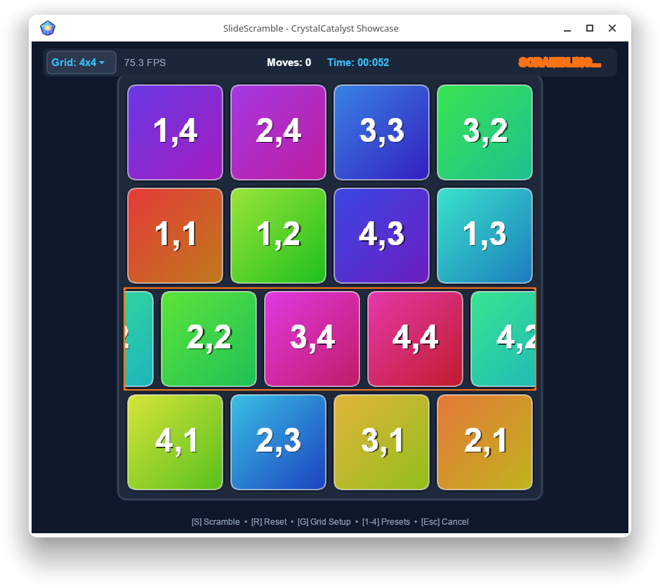

# SlideScramble

**SlideScramble** is a wraparound row-and-column puzzle built as a showcase application for **CrystalCatalyst**.

Unlike the traditional missing-tile sliding puzzle, SlideScramble has no empty space.

Instead, the player may grab an entire row or column and slide it in either direction. Tiles wrap around the opposite edge of the board, allowing every move to transform the puzzle while preserving the complete grid.

<p align="center">
  
</p>

## The Puzzle

Each tile has a home coordinate.

The goal is simple:

> Return every tile to its original position.

The mechanism is equally simple:

- drag a row left or right;
- drag a column up or down;
- movement wraps continuously around the grid;
- release to commit the move.

From those rules comes a surprisingly rich puzzle.

A single move affects an entire line of tiles, and fixing one relationship may disturb another. The player therefore works with the structure of the board rather than moving isolated pieces.

## Build Your Own Puzzle

SlideScramble is not limited to a single board size.

The grid can be configured independently in each dimension, making boards such as:

```text
2 x 4
3 x 3
3 x 5
4 x 4
5 x 7
9 x 9
```

possible from the same game.

This changes more than the amount of work required.

A narrow rectangular board behaves differently from a square one. Row and column cycles interact differently, visual strategies change, and patterns that are useful on one geometry may be much less useful on another.

For that reason, grid dimensions act almost like **puzzle parameters or levels**.

SlideScramble can therefore be thought of not only as one puzzle, but as a small generator for a family of related puzzles.

## Controls

The current HUD exposes the main game operations directly.

```text
S       Scramble
R       Reset
G       Grid Setup
1-4     Grid presets
Esc     Cancel
```

Rows and columns are manipulated directly with the pointer.

The Grid Setup interface allows the board dimensions to be selected independently.

## Scrambling

Starting a game performs a sequence of legal row and column transformations.

Because the scrambled state is produced through the same operations available to the player, the resulting puzzle remains reachable through normal play.

The move counter begins when the scramble is complete.

## Audio

SlideScramble uses **CrystalOpenAL** for lightweight game audio.

Sound is deliberately restrained and serves primarily as interaction feedback rather than as a continuous soundtrack.

The application also exercises the managed CrystalOpenAL infrastructure, including `AudioEngine`, synthesized PCM effects, and the pointerless OpenAL bridge layer.

## CrystalCatalyst Showcase

SlideScramble was created both as a game and as a practical consumer of the CrystalCatalyst libraries.

It exercises several parts of the platform together:

- CrystalCatalyst window creation and input;
- CrystalSkia rendering;
- pointer-driven interaction;
- responsive layout;
- HUD controls;
- game-state management;
- CrystalOpenAL audio;
- managed/native bridge infrastructure.

It is intentionally a complete interactive program rather than an isolated API test.

## Design

The program keeps the puzzle model separate from presentation where practical.

The core concepts include:

```text
Tile
    remembers its home coordinate

Grid
    owns the current tile arrangement
    performs row and column transformations

GameState
    tracks Ready, Scrambling, InGame, and completion state

Window
    handles presentation, input, animation, HUD, and integration
```

This makes the grid mechanics independently understandable and testable while allowing the showcase application to remain visually rich.

## Why Wraparound?

Wraparound movement removes the special empty-cell state of a conventional sliding puzzle.

Every row and every column is always available.

This creates a different kind of reasoning problem.

Instead of asking:

> Which tile can move into the empty space?

the player asks:

> Which cyclic transformation improves the relationships among several tiles at once?

The resulting puzzle is spatial, but it also has an algebraic flavor: every move is a reversible permutation of one row or column.

## Reversibility

Every legal SlideScramble move has an immediate inverse.

Moving a row one position to the right can be undone by moving it one position to the left. The same is true for columns and for larger shifts.

This gives the game a useful property:

**the puzzle changes through reversible transformations rather than destructive state changes.**

That makes experimentation natural. A player can try a move, observe its effect, and reason backward when necessary.

## Difficulty Is More Than Size

Larger boards generally provide more relationships to manage, but board area is not the only source of difficulty.

Geometry matters.

For example:

```text
2 x 4
```

and

```text
4 x 2
```

contain the same number of tiles, yet emphasize different row and column structures.

Likewise, a long narrow grid may encourage very different strategies from a compact square grid.

Future experimentation may reveal useful categories of board geometry, move efficiency, or characteristic solving strategies.

## Development Status

SlideScramble is an active CrystalCatalyst showcase and experimental puzzle.

Current work has focused on:

- polished row and column dragging;
- wraparound animation;
- configurable grid dimensions;
- presets;
- responsive fitting of different board geometries;
- restrained game audio;
- CrystalOpenAL integration;
- automated tests around puzzle and audio infrastructure.

The game is intentionally being allowed to develop through play as well as implementation.

## Project Location

```text
Project/CrystalCatalystLibrary.net/SlideScramble
```

The accompanying source is intended to remain readable as a practical CrystalCatalyst application example.