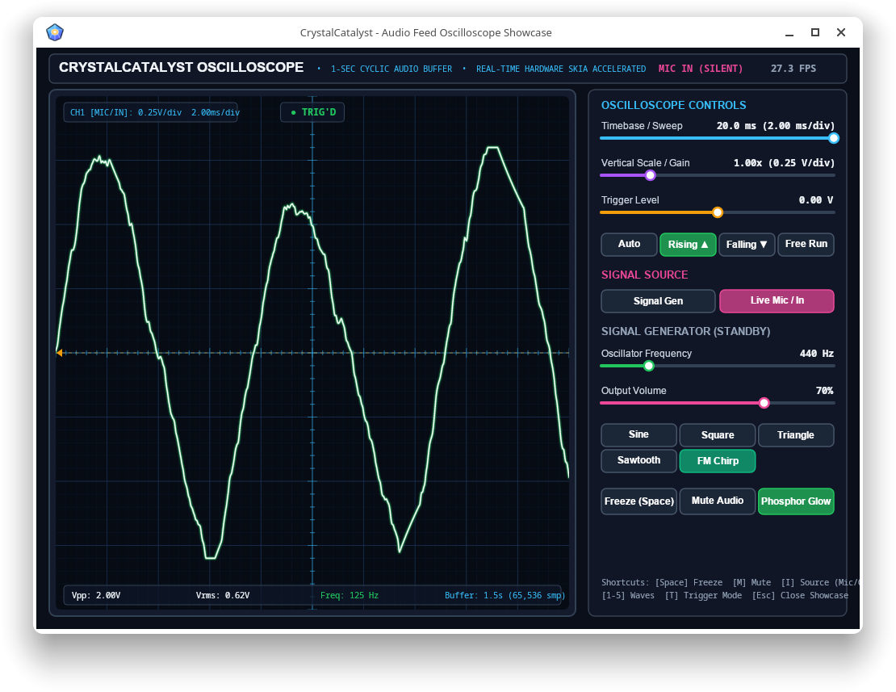

# StreamerTrial

**StreamerTrial** is a high-performance, real-time CRT Oscilloscope, Signal Analyzer, and Procedural Audio Streamer built on top of **CrystalCatalyst**, **SkiaSharp** (`CrystalSkia.net`), and **OpenAL** (`CrystalOpenAL`).

It serves as an interactive reference application demonstrating continuous low-latency audio streaming, live microphone/line-in capture analysis, thread-safe lock-free circular buffering, edge-synchronized waveform triggering, and vector-rendered CRT phosphor visualization.

---


## Key Features

### 1. Dual Signal Ingestion Modes
- **Procedural Signal Generator (Default)**: Synthesizes continuous, phase-accumulating waveforms in real time and streams them directly to audio output hardware via `CrystalOpenAL.AudioStreamer`.
  - **Supported Waveforms**: Sine, Square, Triangle, Sawtooth, and Exponential FM Chirp.
- **Silent Live Audio Input / Capture**: Captures live audio from the default microphone or line-in input device using OpenAL ALC capture (`CrystalOpenAL.AudioCapture`), feeding the oscilloscope display in real-time while keeping speaker output silent to prevent acoustic feedback.

### 2. Lock-Free Cyclic Buffer & Edge Trigger Engine
- **Oversized Circular Buffer**: Sized to hold at least 1.0 second of audio samples (power-of-two capacity for fast bitwise wrapping) with lock-free atomic sample ingestion (`Interlocked.Increment`).
- **Edge-Synchronized Triggering**:
  - **Auto**: Searches backward for a rising edge crossing at the set trigger level, gracefully falling back to a free-running window if no crossing is detected.
  - **Rising**: Locks to rising edge transitions ($x[t-1] < \text{threshold} \le x[t]$).
  - **Falling**: Locks to falling edge transitions ($x[t-1] > \text{threshold} \ge x[t]$).
  - **Free-Run**: Continuously streams the latest buffer window without synchronization.
- **Live Signal Telemetry**: Computes Peak-to-Peak Voltage ($V_{pp}$), Root Mean Square ($V_{rms}$), and estimated fundamental frequency ($f_{est}$) via zero-crossing analysis.

### 3. SkiaSharp CRT Phosphor Display
- **Hardware-Accelerated Vector Graphics**: Renders at native high-DPI resolution using SkiaSharp.
- **Phosphor Glow & Multi-Pass Bloom**: Emulates authentic CRT phosphor traces with a wide ambient glow path underneath an intense, high-brightness core beam.
- **Dynamic CRT Graticule & Reticle**: Anti-aliased division grid with center crosshairs and micro-tick marks.
- **Status HUD Badges**: Displays real-time channel indicators (Generator vs. Live Mic), trigger lock status, timebase, vertical scale, and live signal telemetry.

### 4. Interactive Control Panel
- **Custom Skia UI Controls**: Responsive, smooth mouse drag/click sliders and toggle buttons.
- **Signal Generator Controls**: Real-time frequency (20 Hz – 2000 Hz), volume (0% – 100%), waveform selection, and audio mute.
- **Oscilloscope Controls**: Timebase (0.1 ms/div – 20.0 ms/div), vertical gain (0.2× – 5.0×), trigger level (-1.0 V – +1.0 V), and trigger mode selectors.

---

## Solution Structure

```
StreamerTrial/
├── StreamerTrial.sln                   # Visual Studio / .NET Solution
├── StreamerTrial.md                    # Project Documentation
├── StreamerTrial/
│   ├── StreamerTrial.csproj            # Main application project (.NET 10)
│   ├── Program.cs                      # Entry point initializing window & engine
│   ├── Window.cs                       # CRT oscilloscope UI, HUD, and Skia rendering loop
│   ├── OscilloscopeModel.cs            # Oscilloscope state, synthesis, and capture model
│   └── UIControls.cs                   # Interactive Skia slider and button controls
└── StreamerTrial.Tests/
    ├── StreamerTrial.Tests.csproj      # xUnit test suite
    ├── AudioCyclicBufferTests.cs       # Tests for buffer capacity, wrap-around, triggering, & telemetry
    └── OscilloscopeTests.cs            # Tests for waveform generation, mute, and capture modes
```

---

## Controls & Keyboard Shortcuts

| Shortcut | Control | Action |
| :--- | :--- | :--- |
| **`[1]`** | Waveform | Select **Sine** wave |
| **`[2]`** | Waveform | Select **Square** wave |
| **`[3]`** | Waveform | Select **Triangle** wave |
| **`[4]`** | Waveform | Select **Sawtooth** wave |
| **`[5]`** | Waveform | Select **FM Chirp** |
| **`[M]`** | Audio | Toggle **Mute** (audio output silence) |
| **`[I]`** | Signal Source | Toggle between **Signal Generator** and **Live Mic / Input** |
| **`[Space]`** | Oscilloscope | Toggle **Run / Freeze** capture |
| **`[A]`** | Trigger | Select **Auto** trigger mode |
| **`[R]`** | Trigger | Select **Rising Edge** trigger mode |
| **`[F]`** | Trigger | Select **Falling Edge** trigger mode |
| **`[X]`** | Trigger | Select **Free-Run** trigger mode |
| **`[Esc]`** | Window | Close application |

---

## Building and Running

### Prerequisites
- **.NET 10 SDK** (or later)
- **CrystalCatalyst native runtime libraries** and **OpenAL** (`libopenal.so.1` / `openal32.dll`)

### Build Solution
```bash
dotnet build StreamerTrial.sln
```

### Run Application
```bash
dotnet run --project StreamerTrial/StreamerTrial.csproj
```

### Run Tests
```bash
dotnet test StreamerTrial.sln
```

---

## Core Dependencies & Integration

- **`CrystalCatalystLibrary.net`**: Window management, input events, and pixel data presentation.
- **`CrystalSkia.net`**: High-performance SkiaSharp integration with `PixData` canvas backing.
- **`CrystalOpenAL`**:
  - `AudioStreamer`: Background dynamic double-buffering audio streaming.
  - `AudioCapture`: Non-blocking OpenAL ALC hardware audio capture thread.
  - `AudioCyclicBuffer`: Lock-free ring buffer with trigger detection and signal measurement.
